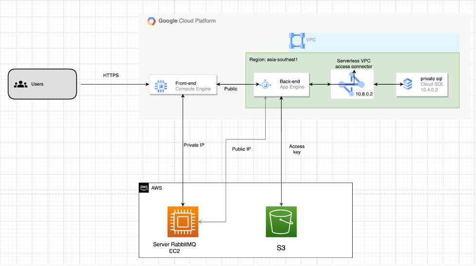

<h3 align="center">Demo Cloud</h3>

---

 Demo cloud service on cloud provider
      

## 📝 Table of Contents

- [📝 Table of Contents](#-table-of-contents)
- [🧐 About ](#-about-)
- [✍️ Architecture  ](#️-architecture--)
- [✍️ Detail Config  ](#️-detail-config--)
- [⛏️ Built Using ](#️-built-using-)
- [✍️ Authors ](#️-authors-)

## 🧐 About 

Our web application consists of a front-end running on Google Compute Engine, a back-end running on Google App Engine, and using a RabbitMQ server running on Amazon Elastic Compute Cloud. We use Google Cloud SQL to store the database, use Amazon Simple Storage Service to store photos and files.

## ✍️ Architecture  

## ✍️ Detail Config  

This is the detailed documentation on how to configure on cloud AWS, GCP.

- [Document](https://docs.google.com/document/d/1nkdnIFAAAB5tYTWLlBv46qWq0tfUT3aSTZYEun0iGfA)

## ⛏️ Built Using 

- [MySQL](https://www.mysql.com/) - Database
- [Express](https://expressjs.com/) - Server Framework
- [ReactJs](https://legacy.reactjs.org/) - Web Framework
- [NodeJs](https://nodejs.org/en/) - Server Environment

## ✍️ Authors 

- [@TranManhSon](https://github.com/TranManhSon) - Idea & Initial work

